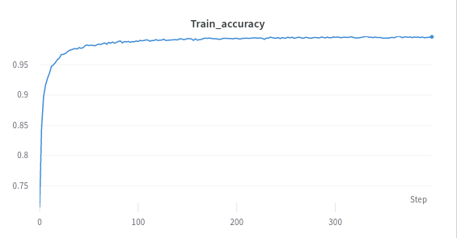
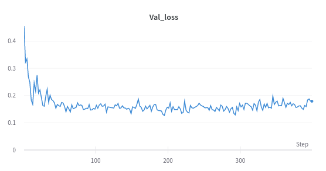
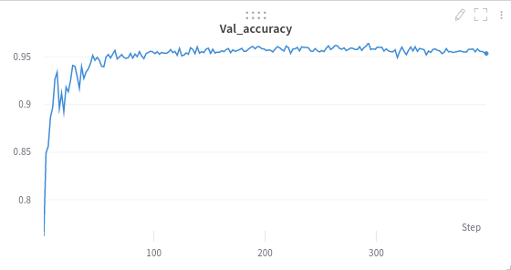

# Siamese Networks using Omniglot Dataset

* A implementation of Siamese Networks in Pytorch using Omniglot dataset.

## Experiment result
* Train loss : 0.01403
* Train accuracy :0.99635
* Val loss : 0.17926
* Val accuracy : 0.95382

 

 



# Usage
```
python train.py [-h] [--margin MARGIN] [--lr LR] [--epoch EPOCH] [--batch BATCH] [--project PROJECT] [--name NAME] [--workers WORKERS] [--augment] [--candi CANDI] [--shuffle] [--seed SEED]

optional arguments:
  -h, --help         show this help message and exit
  --margin MARGIN    magin of siamese
  --lr LR            initial learning rate
  --epoch EPOCH      # of epoch
  --batch BATCH      # of batch
  --project PROJECT  save to project/name
  --name NAME        save to project/name
  --workers WORKERS  maximum number of dataloader workers
  --augment          Data augmentation
  --candi CANDI      batch size of val, test loader
  --shuffle          training data shuffle
  --seed SEED        random seed integer
```


## References
* [BUZZINGPolarBear](https://github.com/BUZZINGPolarBear/Why_Am_I_ALONE)
* [fangpin](https://github.com/fangpin/siamese-pytorch)